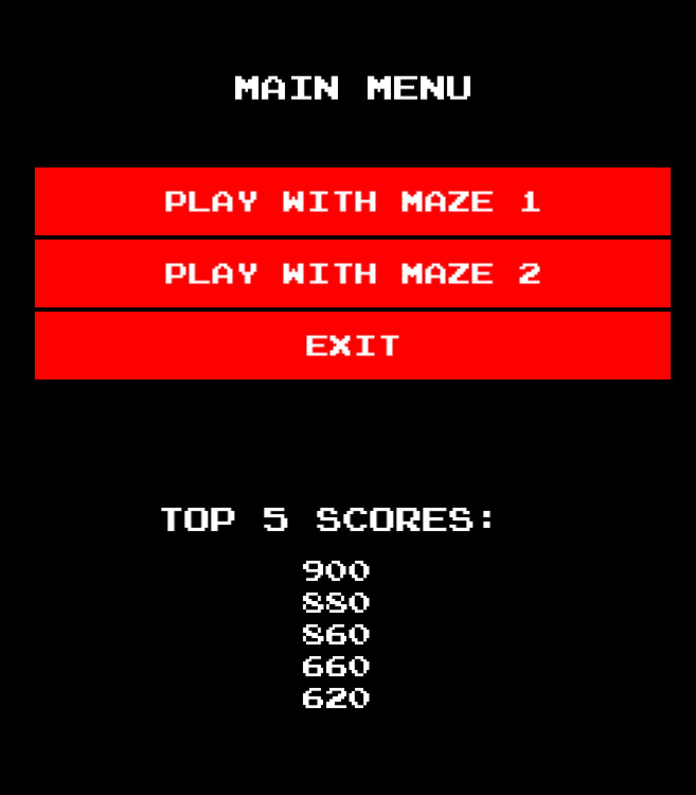
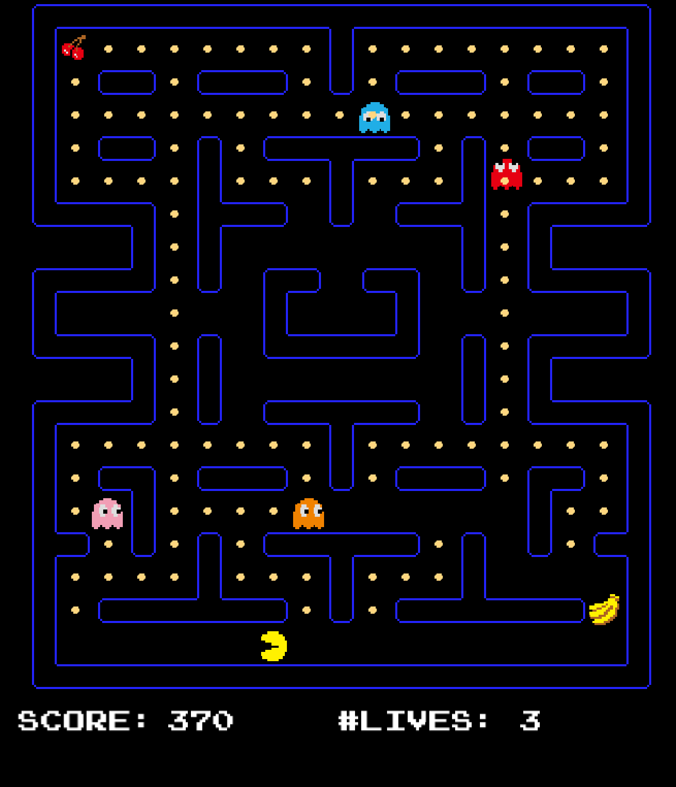
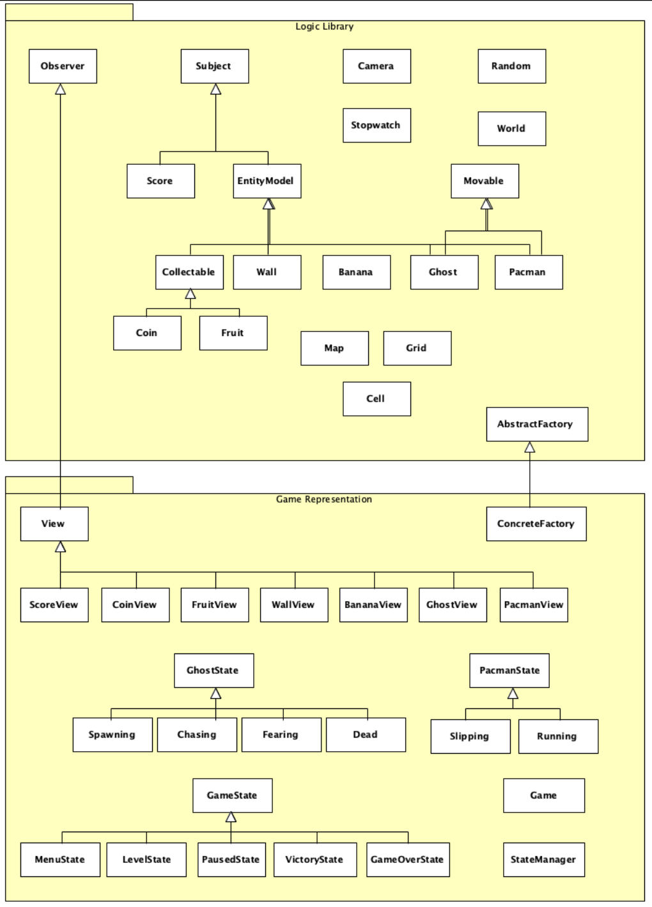

Pacman project in C++
=======================================

Project developed during Advanced Programming course in UAntwerp.

Usage of SFML Library.

## Appearance

## Logical Structure

See report.pdf for more details

#### Sad story short
It caused a lot of tears and blood and I didn't even pass the course.
